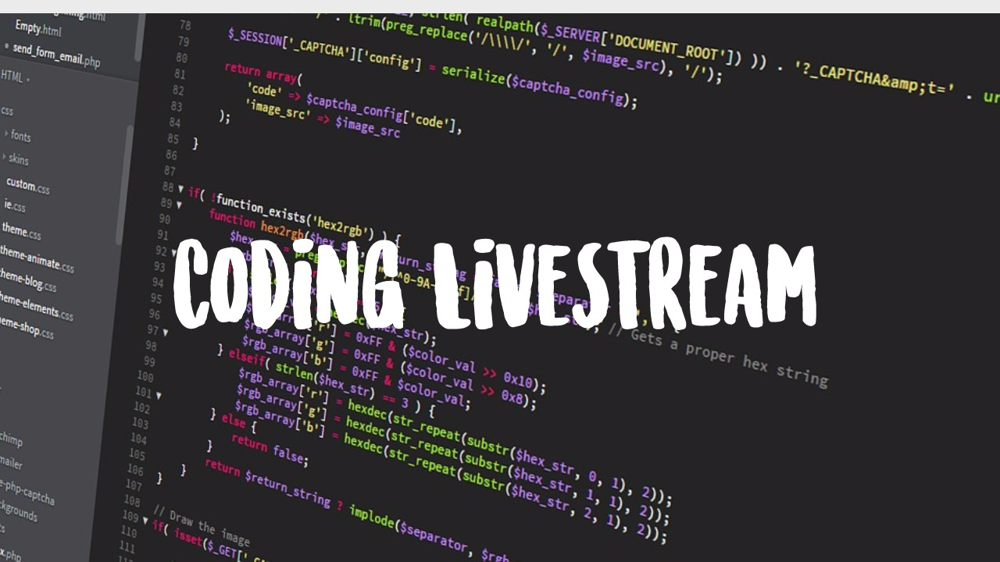

# Flask Introduction

## About

Flask adalah Microframework yang sering digunakan untuk membuat Aplikasi berbasis Web. Disini kita mengulik sedikit tentang Flask dan juga struktur direktori yang baik digunakan untuk membuat suatu Aplikasi menggunakan Flask.

## Teacher

 - Abhishta Gatya (@gat)

## Source Material

 - [Flask Website](http://flask.pocoo.org/) - Website Flask Microframework
 - [Explore Flask](http://exploreflask.com/en/latest/organizing.html) - Struktur direktori Flask
