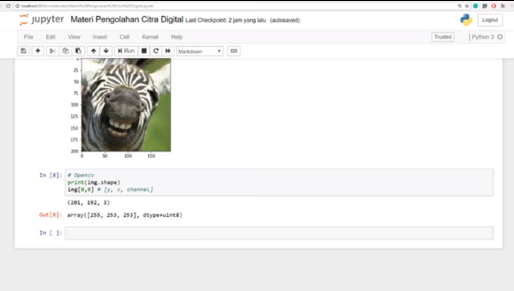

# Pengolahan Citra Digital

## About

Pengolahan Citra Digital atau juga bisa dikatakan Image Processing adalah suatu metode untuk melakukan beberapa operasi pada citra atau gambar.

## Teacher

 - Ais (@ninja-cutting onion)

## Source Material

  - To Be Added
